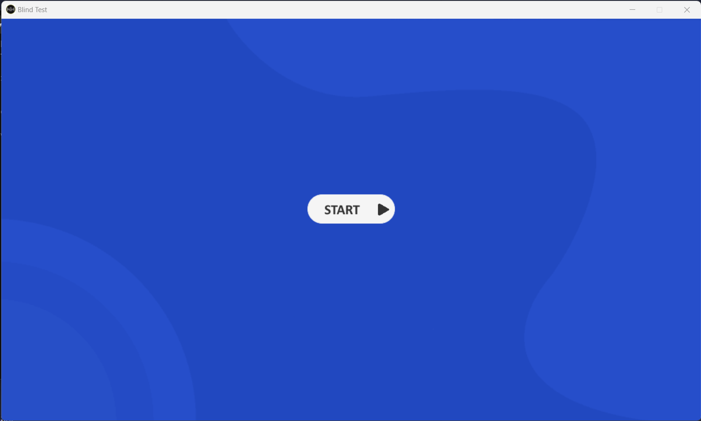

<h1 align="center">
  <br>
  </a>
  <br>
  Blind Quiz
  <br>
</h1>

<h4 align="center">Une application de blind quiz faite en <a href="https://www.python.org/" target="_blank">Python</a>.</h4>

<p align="center">
  <a href="https://code.visualstudio.com/">
    
  </a>
  <a href="https://www.python.org/">
   
 </a>
</p>

<p align="center">
  <a href="#Informations">Informations générales</a> •
  <a href="#catégories">Catégories</a> •
  <a href="#images">Images</a>
</p>

## Informations générales

``` bash
$ pip install -r requirements.txt
$ python BlindTest.py
```

## Catégories

* Musique
* Cinéma (Non implémenté)
* Séries (Non implémenté)
* VideoGames (Non implémenté)

## Images




